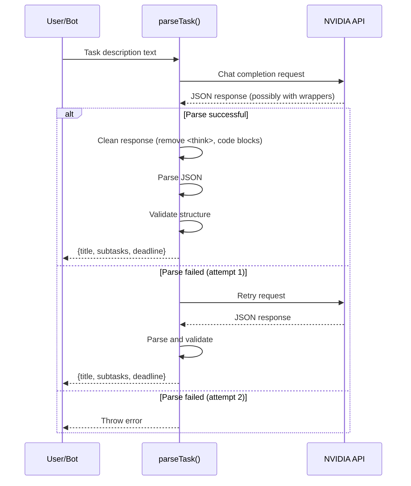

# Feature: AI Task Parsing

Status: Implemented  
Owner: Core Team  
Created: 2025-12-12  
Links: —

---

## Purpose

Uses AI (NVIDIA's minimaxai/minimax-m2 model) to parse natural language task descriptions in Russian and extract structured data: title, subtasks, and deadline. Enables users to create tasks by simply describing them in conversational text.

---

## Scope

### In scope

- Title extraction (max 70 characters)
- Subtask identification
- Deadline detection from text
- Russian language support
- Relative date interpretation ("завтра", "в пятницу", "через 3 дня")
- JSON response parsing with error handling
- Retry logic (2 attempts max)

### Out of scope

- Task categorization/tagging
- Priority detection
- Assignee extraction
- Multi-language support
- Fine-tuning or custom models

---

## Business Rules

- Input: Free-form Russian text describing a task
- Output: JSON object with title, subtasks array, and deadline (YYYY-MM-DD or null)
- Reference date provided for relative date interpretation
- Title limited to 70 characters
- Deadlines always resolve to future dates (or today)
- AI response cleaned of `<think>` tags and code blocks
- Retry on parse failure (max 2 attempts)

---

## User Flows

### Primary flows

1. **Parse Task from Bot Message**  
   - Actor: User via Telegram Bot  
   - Trigger: User sends text message  
   - Steps: Bot calls `parseTask()` → AI returns JSON → Parse and validate → Return structured data  
   - Result: Task draft with title, subtasks, deadline

### Edge cases

- AI returns malformed JSON → Retry once, then throw error
- Missing title in response → Throw TypeError
- No deadline in text → Return null for deadline
- `<think>` tags in response → Stripped before parsing
- Code block wrapper → Stripped before parsing

---

## System Behaviour

- Entry points: `parseTask(text, referenceDate)` in lib/ai.ts  
- Reads from: NVIDIA API  
- Writes to: None (pure function)  
- Side effects: API call to NVIDIA  
- Idempotency: Same input may produce different outputs (AI non-deterministic)  
- Error handling: Retry once, then throw  
- Security: NVIDIA_API_KEY in environment  
- Observability: Console logs for failures

### AI Model Configuration

| Parameter | Value |
|-----------|-------|
| Model | minimaxai/minimax-m2 |
| Temperature | 0.1 |
| Max tokens | 8192 |
| Response format | JSON object |
| Base URL | https://integrate.api.nvidia.com/v1 |

### System Prompt

```
You are a helpful assistant that parses Russian task descriptions. 
You don't do these tasks, only parse. Return ONLY JSON: 
{ "title": string (<=70 chars), "subtasks": string[], "deadline": "YYYY-MM-DD" | null }. 
Use today's date {referenceDate} when interpreting phrases like "в пятницу" or "через 3 дня" 
and always pick the nearest future date. If deadline is missing, set it to null.
```

---

## Diagrams



---

## Verification (Mandatory: describe how to test)

### Test environment

- Environment: Local with NVIDIA_API_KEY  
- Data: Sample Russian task descriptions  
- External dependencies: NVIDIA API

### Test commands

- build: `pnpm build`
- test: `pnpm lint`
- format: `pnpm lint`

### Test flows

**Positive scenarios**

| ID | Description | Level | Expected result | Data / Notes |
| --- | --- | --- | --- | --- |
| POS-001 | Parse simple task | Unit | Valid title and subtasks | "Сделать отчёт" |
| POS-002 | Parse task with deadline | Unit | Correct date extracted | "Сделать к пятнице" |
| POS-003 | Parse relative date | Unit | Future date calculated | "через 3 дня" |

**Negative scenarios**

| ID | Description | Level | Expected result | Data / Notes |
| --- | --- | --- | --- | --- |
| NEG-001 | Empty response | Unit | Error thrown | AI returns nothing |
| NEG-002 | Invalid JSON | Unit | Retry, then error | Malformed response |
| NEG-003 | Missing NVIDIA_API_KEY | Unit | Error thrown | No env var |

**Edge cases**

| ID | Description | Level | Expected result | Data / Notes |
| --- | --- | --- | --- | --- |
| EDGE-001 | Response with `<think>` tags | Unit | Tags stripped, JSON parsed | DeepThink model |
| EDGE-002 | Response in code block | Unit | Code block stripped | Markdown wrapper |
| EDGE-003 | No deadline in text | Unit | deadline = null | Ambiguous description |

### Test mapping

- Unit tests: —  
- Integration tests: Bot message handling  
- Static analysis: ESLint

---

## Definition of Done

- AI correctly parses Russian task descriptions  
- Deadlines extracted for relative and absolute dates  
- Retry logic handles transient failures  
- Response cleaning handles various wrapper formats

---

## References

- Code: `lib/ai.ts`
- Used by: `lib/bot/index.ts` (task creation flow)
- Dependencies: OpenAI SDK (compatible with NVIDIA API)
- Environment: NVIDIA_API_KEY