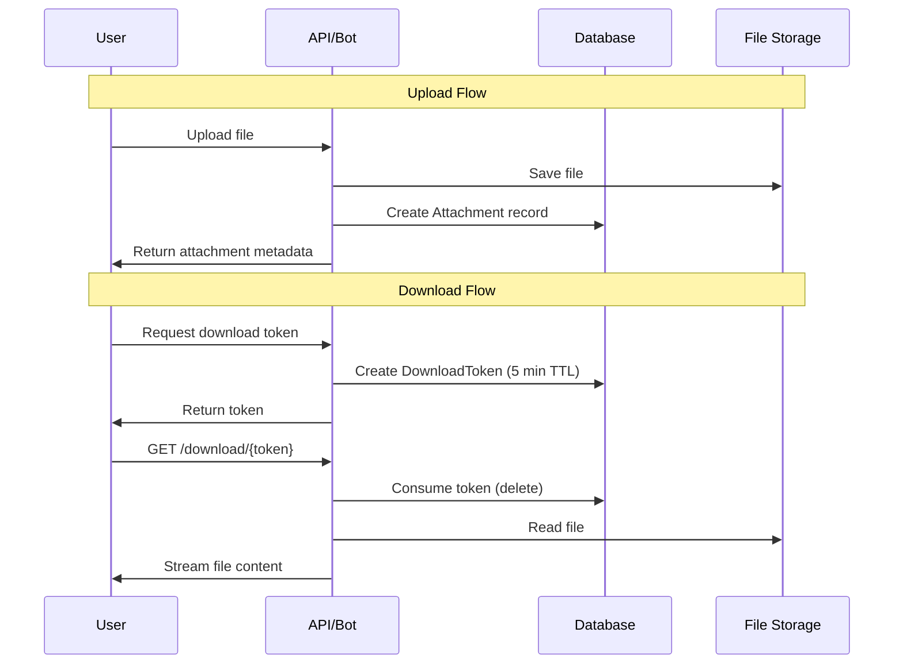

# Feature: Attachments

Status: Implemented  
Owner: Core Team  
Created: 2025-12-12  
Links: —

---

## Purpose

Enables file attachments on tasks. Users can upload documents and images via the Telegram bot or web interface. Files are stored locally with secure time-limited download tokens for access control.

---

## Scope

### In scope

- File upload via Telegram (documents, photos)
- File upload via Web API (multipart form)
- Local file storage with unique naming
- Telegram file reference storage (for bot-uploaded files)
- Time-limited download tokens (5-minute TTL)
- Attachment metadata (filename, MIME type, size)
- Team notifications on new attachments

### Out of scope

- Cloud storage (S3, GCS)
- File previews/thumbnails
- Virus scanning
- File versioning

---

## Business Rules

- Maximum file size: 2GB (Telegram limit)
- Only users with task access can upload attachments (manager, creator, assignee, or team member)
- Files can only be attached to tasks with status: IN_PROGRESS, PAUSED, or OVERDUE
- Download tokens expire after 5 minutes
- Each download token can only be used once (consumed on access)
- Telegram attachments store file_id for bot API access
- External (web) attachments are stored in local `storage/` directory

---

## User Flows

### Primary flows

1. **Upload via Telegram**
   - Actor: User with task access
   - Trigger: Select task → Send document/photo
   - Steps: Validate access → Save Telegram file reference → Create attachment record → Notify team
   - Result: Attachment linked to task

2. **Upload via Web**
   - Actor: User with task access
   - Trigger: POST /api/tasks/{id}/attachments with file
   - Steps: Validate auth → Validate permissions → Save to storage → Create record → Notify manager
   - Result: Attachment saved, metadata returned

3. **Download via Token**
   - Actor: User with task access
   - Trigger: Request token → Access download URL
   - Steps: Generate token (5 min TTL) → User accesses /api/attachments/download/{token} → Token consumed → File served
   - Result: File downloaded

### Edge cases

- Token expired → 410 Gone response
- Token not found → 404 Not Found
- File size > 2GB → 413 Payload Too Large
- User loses task access after upload → Download still possible with valid token

---

## System Behaviour

- Entry points:
  - `POST /api/tasks/{id}/attachments` (web upload)
  - `GET /api/attachments/{id}/token` (generate download token)
  - `GET /api/attachments/download/{token}` (download file)
  - Telegram bot message handlers (document/photo)
- Reads from: PostgreSQL (Attachment, DownloadToken), Local storage
- Writes to: PostgreSQL (Attachment, DownloadToken), Local `storage/` directory
- Side effects: Telegram notifications to task stakeholders
- Idempotency: Uploads create new records (not idempotent)
- Error handling: Structured JSON errors
- Security / permissions: Task access check + download tokens
- Observability: Console error logging

---

## Diagrams

---

## Verification (Mandatory: describe how to test)

### Test environment

- Environment: Local Docker with storage volume
- Data: Test tasks with attachments
- External dependencies: Telegram Bot API (for bot uploads)

### Test commands

- build: `pnpm build`
- test: `pnpm lint`
- format: `pnpm lint`

### Test flows

**Positive scenarios**

| ID      | Description               | Level       | Expected result                 | Data / Notes            |
| ------- | ------------------------- | ----------- | ------------------------------- | ----------------------- |
| POS-001 | Upload PDF via web        | API         | Attachment created, file stored | Valid auth, task access |
| POS-002 | Upload photo via bot      | Integration | Telegram file ID saved          | Bot message             |
| POS-003 | Download with valid token | API         | File served, token consumed     | Fresh token             |

**Negative scenarios**

| ID      | Description                 | Level | Expected result       | Data / Notes      |
| ------- | --------------------------- | ----- | --------------------- | ----------------- |
| NEG-001 | Upload without task access  | API   | 403 Forbidden         | Unauthorized user |
| NEG-002 | Download with expired token | API   | 410 Gone              | Token > 5 min old |
| NEG-003 | File exceeds 2GB            | API   | 413 Payload Too Large | Large file        |

**Edge cases**

| ID       | Description                 | Level       | Expected result  | Data / Notes          |
| -------- | --------------------------- | ----------- | ---------------- | --------------------- |
| EDGE-001 | Reuse consumed token        | API         | 404 Not Found    | Token already deleted |
| EDGE-002 | Upload to DONE task via bot | Integration | Task not in list | Status filter         |

### Test mapping

- Integration tests: —
- API tests: Manual HTTP testing
- Unit tests: —
- Static analysis: ESLint

---

## Definition of Done

- Files upload and download correctly
- Tokens expire and are consumed properly
- Team notifications sent on new uploads
- Unauthorized access rejected

---

## References

- Code:
  - `lib/attachments.ts` (attachment creation)
  - `lib/download-tokens.ts` (token management)
  - `lib/storage.ts` (file storage utilities)
  - `app/api/tasks/[taskId]/attachments/route.ts` (web upload)
  - `app/api/attachments/[attachmentId]/token/route.ts` (token generation)
  - `app/api/attachments/download/[token]/route.ts` (file download)
  - `lib/bot/index.ts` (Telegram upload handlers)
- Schema: `prisma/schema.prisma` (Attachment, DownloadToken models)
