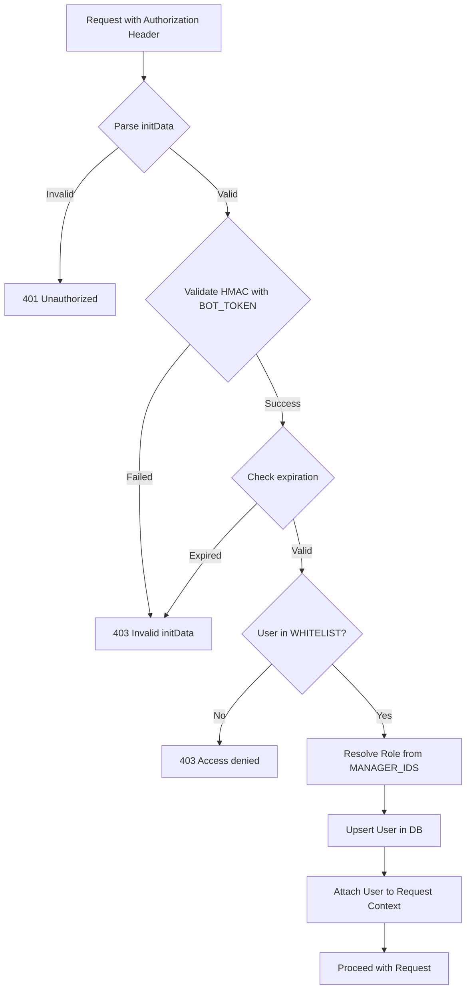
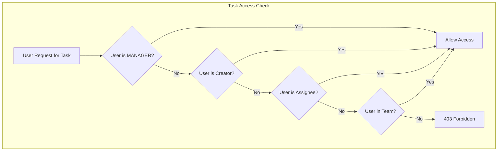

# Feature: Authentication & Authorization

Status: Implemented  
Owner: Core Team  
Created: 2025-12-12  
Links: —

---

## Purpose

Provides secure authentication using Telegram's WebApp authentication mechanism and role-based access control (RBAC) for managing permissions between managers and employees.

---

## Scope

### In scope

- Telegram WebApp initData validation
- User whitelist enforcement
- Role assignment (MANAGER vs EMPLOYEE)
- Automatic user provisioning
- Session validation with expiration
- Per-task access control

### Out of scope

- Traditional username/password authentication
- OAuth with third-party providers
- Multi-factor authentication
- API keys for external integrations
- Fine-grained permissions (beyond MANAGER/EMPLOYEE)

---

## Business Rules

- Only users in WHITELIST environment variable can access the system
- Users in MANAGER_IDS are assigned MANAGER role; others are EMPLOYEE
- Telegram initData must be validated with BOT_TOKEN
- initData expires after 1 hour
- Users are auto-created on first access (if whitelisted)
- User names sync from Telegram on each request
- Role changes take effect immediately (on env var change + next request)

### Role Permissions

| Permission | EMPLOYEE | MANAGER |
|------------|----------|---------|
| View own tasks | ✅ | ✅ |
| View all tasks | ❌ | ✅ |
| Create tasks | ✅ | ✅ |
| Update own task status | ✅ | ✅ |
| Set status to CLOSED | ❌ | ✅ |
| Reassign tasks | ❌ | ✅ |
| Update tags/projects | ❌ | ✅ |
| Manage team | ❌ | ✅ |
| Approve/reject completion | ❌ | ✅ |
| Remove deadlines | ❌ | ✅ |
| Set past deadlines | ❌ | ✅ |

### Task Access Rules

A user can access a task if:
- User is MANAGER (full access to all tasks), OR
- User is the task creator, OR
- User is the task assignee, OR
- User is a team member (in TaskAssignment)

---

## User Flows

### Primary flows

1. **WebApp Authentication**  
   - Actor: User opening Telegram WebApp  
   - Trigger: API request with Authorization header  
   - Steps: Extract initData → Validate with BOT_TOKEN → Parse user info → Check whitelist → Create/update user → Return user context  
   - Result: Authenticated request proceeds or 401/403 returned

2. **Bot Authentication**  
   - Actor: User sending message to bot  
   - Trigger: Any bot message/callback  
   - Steps: Middleware extracts ctx.from.id → Check whitelist → Create/update user → Attach to context  
   - Result: User attached to bot context or "Доступ запрещен" message

3. **Role Resolution**  
   - Actor: System  
   - Trigger: User authentication  
   - Steps: Check if Telegram ID in MANAGER_IDS → Assign MANAGER or EMPLOYEE  
   - Result: Role stored in database and available for authorization

4. **Task Access Check**  
   - Actor: System  
   - Trigger: Task-related API/bot operation  
   - Steps: Fetch task with relations → Check user role → Check ownership/assignment → Allow or deny  
   - Result: Operation proceeds or 403 returned

### Edge cases

- User removed from whitelist → Next request fails with 403
- User added to MANAGER_IDS → Role updates on next request
- initData expired → 403 Invalid initData
- Missing Authorization header → 401 Unauthorized

---

## System Behaviour

- Entry points:  
  - `lib/auth.ts` (WebApp validation)
  - `lib/users.ts` (user management, whitelist)
  - Bot middleware in `lib/bot/index.ts`
- Reads from: Environment variables (WHITELIST, MANAGER_IDS, BOT_TOKEN), User table  
- Writes to: User table (create/update)  
- Side effects: None  
- Idempotency: Yes (same user info = no DB change)  
- Error handling: Returns appropriate HTTP status codes  
- Security:  
  - HMAC validation of Telegram initData
  - 1-hour expiration window
  - Whitelist enforcement
- Observability: Console logging for validation failures

---

## Diagrams

---

## Verification (Mandatory: describe how to test)

### Test environment

- Environment: Local with BOT_TOKEN, WHITELIST, MANAGER_IDS configured  
- Data: Test Telegram users  
- External dependencies: Telegram Bot API (for initData validation)

### Test commands

- build: `pnpm build`
- test: `pnpm lint`
- format: `pnpm lint`

### Test flows

**Positive scenarios**

| ID | Description | Level | Expected result | Data / Notes |
| --- | --- | --- | --- | --- |
| POS-001 | Valid whitelisted user | API | 200 with user data | Valid initData |
| POS-002 | Manager role assigned | API | user.role = MANAGER | User in MANAGER_IDS |
| POS-003 | User auto-created | API | User record in DB | First-time whitelisted user |

**Negative scenarios**

| ID | Description | Level | Expected result | Data / Notes |
| --- | --- | --- | --- | --- |
| NEG-001 | Missing auth header | API | 401 Unauthorized | No Authorization |
| NEG-002 | Non-whitelisted user | API | 403 Access denied | Unknown Telegram ID |
| NEG-003 | Expired initData | API | 403 Invalid initData | > 1 hour old |
| NEG-004 | Invalid HMAC | API | 403 Invalid initData | Tampered data |

**Edge cases**

| ID | Description | Level | Expected result | Data / Notes |
| --- | --- | --- | --- | --- |
| EDGE-001 | Role change mid-session | API | New role on next request | Env var update |
| EDGE-002 | Name update from Telegram | API | Name synced in DB | Changed Telegram name |

### Test mapping

- Integration tests: —  
- API tests: Manual HTTP testing  
- Unit tests: —  
- Static analysis: ESLint

---

## Definition of Done

- Telegram initData properly validated  
- Whitelist enforced on all endpoints  
- Roles correctly assigned from env vars  
- Task access rules consistently applied

---

## References

- Code:
  - `lib/auth.ts` (validateTelegramWebAppData)
  - `lib/users.ts` (ensureTelegramUser, isWhitelistedTelegramId, resolveRoleForTelegramId)
  - `lib/bot/index.ts` (bot middleware)
  - `app/api/tasks/route.ts` (auth usage in API)
  - `app/api/tasks/[taskId]/route.ts` (canModifyTask)
- Dependencies: @tma.js/init-data-node
- Schema: `prisma/schema.prisma` (User model with Role enum)