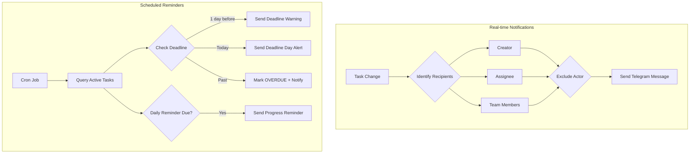

# Feature: Notifications & Reminders

Status: Implemented  
Owner: Core Team  
Created: 2025-12-12  
Links: —

---

## Purpose

Keeps users informed about task updates and upcoming deadlines through Telegram notifications. Includes real-time notifications for task changes and scheduled reminders for deadline management.

---

## Scope

### In scope

- Real-time notifications on task changes (status, assignment, team)
- Daily progress reminders for IN_PROGRESS tasks
- Deadline approaching alerts (1 day before, day of deadline)
- Overdue notifications to assignees
- Manager alerts for overdue tasks
- Attachment upload notifications
- Completion review request notifications

### Out of scope

- Email notifications
- Push notifications (mobile)
- Notification preferences/settings
- Notification history/read status
- Digest notifications

---

## Business Rules

- Notifications sent via Telegram Bot API
- Real-time notifications broadcast to task stakeholders (creator, assignee, team members)
- Actor (person who made change) is excluded from notification
- Daily reminders: Once per day for IN_PROGRESS tasks
- Deadline reminder: 1 day before deadline (once)
- Deadline day notification: On the deadline day (once)
- Overdue notification: When task passes deadline without completion (once)
- Manager notification: When subordinate's task becomes overdue (once)
- Failed notifications are logged but don't block operations

---

## User Flows

### Primary flows

1. **Status Change Notification**
   - Actor: System
   - Trigger: Task status updated
   - Steps: Identify recipients → Exclude actor → Send Telegram message to each
   - Result: Stakeholders informed of status change

2. **Assignment Notification**
   - Actor: System
   - Trigger: Task assigned or reassigned
   - Steps: Notify new assignee → Notify previous assignee (if any)
   - Result: Assignees know their task assignments

3. **Team Change Notification**
   - Actor: System
   - Trigger: Team members added/removed
   - Steps: Notify added members → Notify removed members → Notify remaining team
   - Result: All team members aware of composition changes

4. **Daily Reminder (Scheduled Job)**
   - Actor: Scheduled script
   - Trigger: Cron job execution
   - Steps: Query active tasks → Filter by last reminder date → Send reminder → Update flag
   - Result: Assignees reminded of ongoing tasks

5. **Overdue Detection (Scheduled Job)**
   - Actor: Scheduled script
   - Trigger: Cron job execution
   - Steps: Find tasks past deadline → Set OVERDUE status → Notify assignee → Notify manager
   - Result: Overdue tasks flagged and relevant parties notified

### Edge cases

- User blocks bot → Notification fails silently
- Multiple changes in one request → Multiple notifications may be sent
- Manager is also assignee → No duplicate notification

---

## System Behaviour

- Entry points:
  - Real-time: `broadcastTaskNotification()`, `sendTelegramNotification()` in lib/bot
  - Scheduled: `scripts/reminders.ts` (run via cron)
- Reads from: Task, User tables
- Writes to: Task (reminder tracking fields)
- Side effects: Telegram API calls
- Idempotency: Scheduled reminders use date flags to prevent duplicates
- Error handling: Try-catch with console logging, failures don't propagate
- Observability: Console error logs for failed sends

### Reminder Tracking Fields (on Task)

| Field                    | Purpose                               |
| ------------------------ | ------------------------------------- |
| lastDailyReminderAt      | Last daily reminder sent              |
| lastDeadlineReminderAt   | "1 day before" reminder sent          |
| deadlineDayNotifiedAt    | Deadline day notification sent        |
| overdueNotifiedAt        | Overdue notification to assignee sent |
| managerOverdueNotifiedAt | Overdue notification to manager sent  |

---

## Diagrams

---

## Verification (Mandatory: describe how to test)

### Test environment

- Environment: Local with BOT_TOKEN
- Data: Tasks with various deadlines
- External dependencies: Telegram Bot API

### Test commands

- build: `pnpm build`
- run reminders: `pnpm tsx scripts/reminders.ts`
- format: `pnpm lint`

### Test flows

**Positive scenarios**

| ID      | Description                | Level       | Expected result                      | Data / Notes       |
| ------- | -------------------------- | ----------- | ------------------------------------ | ------------------ |
| POS-001 | Status change notification | Integration | Message sent to stakeholders         | Status update      |
| POS-002 | Assignment notification    | Integration | New assignee receives message        | Reassignment       |
| POS-003 | Overdue detection          | Integration | Status → OVERDUE, notifications sent | Past deadline task |
| POS-004 | Deadline warning           | Integration | Message sent 1 day before            | Upcoming deadline  |

**Negative scenarios**

| ID      | Description     | Level       | Expected result             | Data / Notes |
| ------- | --------------- | ----------- | --------------------------- | ------------ |
| NEG-001 | User blocks bot | Integration | Notification fails silently | Blocked user |
| NEG-002 | Invalid user ID | Integration | Error logged, no crash      | Deleted user |

**Edge cases**

| ID       | Description                   | Level       | Expected result      | Data / Notes          |
| -------- | ----------------------------- | ----------- | -------------------- | --------------------- |
| EDGE-001 | Actor excluded                | Integration | No self-notification | User changes own task |
| EDGE-002 | Duplicate reminder prevention | Integration | Only one per day     | Multiple job runs     |
| EDGE-003 | New deadline clears flags     | API         | Reminder flags reset | Deadline update       |

### Test mapping

- Integration tests: Manual Telegram verification
- Unit tests: —
- Static analysis: ESLint

---

## Definition of Done

- Real-time notifications sent on all task changes
- Scheduled reminders run reliably
- No duplicate notifications
- Failures don't block main operations

---

## References

- Code:
  - `lib/bot/index.ts` (sendTelegramNotification, broadcastTaskNotification)
  - `scripts/reminders.ts` (scheduled reminder job)
  - `app/api/tasks/[taskId]/route.ts` (notification triggers)
- Schema: `prisma/schema.prisma` (reminder tracking fields on Task)
