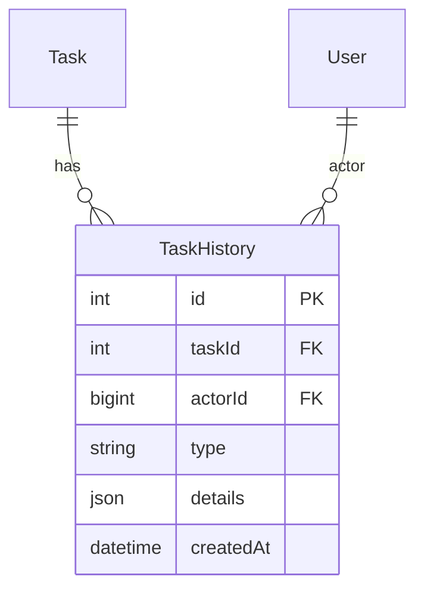

# Feature: Task History & Audit

Status: Implemented  
Owner: Core Team  
Created: 2025-12-12  
Links: —

---

## Purpose

Provides a complete audit trail for task changes. Every significant modification to a task is logged with actor information, timestamp, and change details. Enables transparency, accountability, and debugging of task lifecycle.

---

## Scope

### In scope

- Status change logging
- Deadline change logging
- Assignee change logging
- Team composition changes
- Tag and project updates
- Completion review status changes
- Overdue reason recording
- History display in UI

### Out of scope

- Title/description change tracking
- Attachment history
- Comment history (no comments feature)
- History export

---

## Business Rules

- Every task modification records a history entry
- Actor (user who made change) is captured when available
- System changes (e.g., overdue detection) may have null actor
- History is ordered by timestamp descending (newest first)
- Last 50 history entries are returned with task data
- History entries are immutable (no updates or deletes)

---

## User Flows

### Primary flows

1. **View Task History**
   - Actor: User with task access
   - Trigger: Expand task card in UI
   - Steps: History loaded with task → Rendered in TaskHistoryLog component
   - Result: Chronological list of changes displayed

2. **Log Status Change**
   - Actor: System (triggered by API/Bot)
   - Trigger: Task status updated
   - Steps: Create history entry with type=STATUS_CHANGE, details={from, to}
   - Result: Change permanently recorded

3. **Log Team Change**
   - Actor: Manager
   - Trigger: Team members added/removed
   - Steps: Compare before/after → Log TEAM_CHANGE with member lists
   - Result: Team modification history preserved

### Edge cases

- Multiple changes in one request → Multiple history entries created
- Same value update (no-op) → No history entry created
- Actor not available → actorId = null

---

## System Behaviour

- Entry points: Internal function `logTaskHistory()` called by API/Bot handlers
- Reads from: TaskHistory table
- Writes to: TaskHistory table
- Side effects: None
- Idempotency: Not applicable (always creates new entry)
- Error handling: Errors logged, don't block main operation
- Security: History read access follows task access rules
- Observability: History entries themselves provide observability

---

## Diagrams

### History Entry Types

| Type                 | Details Structure                             | Description                      |
| -------------------- | --------------------------------------------- | -------------------------------- |
| STATUS_CHANGE        | `{from: string, to: string}`                  | Task status changed              |
| DEADLINE_CHANGE      | `{from: string\|null, to: string\|null}`      | Deadline updated                 |
| ASSIGNEE_CHANGE      | `{fromId, fromName, toId, toName}`            | Primary assignee changed         |
| TEAM_CHANGE          | `{from: [{userId, name, isLead}], to: [...]}` | Team composition modified        |
| TAG_CHANGE           | `{from: [tagId], to: [tagId]}`                | Tags updated                     |
| PROJECT_CHANGE       | `{from: [projectId], to: [projectId]}`        | Projects updated                 |
| REVIEW_STATUS_CHANGE | `{from, to, action?, reason?}`                | Completion review status changed |
| OVERDUE_REASON       | `{reason, previousDeadline, newDeadline}`     | Overdue explanation provided     |

---

## Verification (Mandatory: describe how to test)

### Test environment

- Environment: Local Docker with PostgreSQL
- Data: Tasks with various operations performed
- External dependencies: None

### Test commands

- build: `pnpm build`
- test: `pnpm lint`
- format: `pnpm lint`

### Test flows

**Positive scenarios**

| ID      | Description                   | Level | Expected result                            | Data / Notes             |
| ------- | ----------------------------- | ----- | ------------------------------------------ | ------------------------ |
| POS-001 | Status change creates history | API   | TaskHistory record with STATUS_CHANGE type | Valid status transition  |
| POS-002 | Multiple changes logged       | API   | Multiple history entries                   | Status + deadline change |
| POS-003 | History in API response       | API   | task.history array with entries            | GET /api/tasks           |

**Negative scenarios**

| ID      | Description         | Level | Expected result  | Data / Notes      |
| ------- | ------------------- | ----- | ---------------- | ----------------- |
| NEG-001 | No-op status change | API   | No history entry | Same status value |

**Edge cases**

| ID       | Description              | Level       | Expected result         | Data / Notes  |
| -------- | ------------------------ | ----------- | ----------------------- | ------------- |
| EDGE-001 | System-triggered overdue | Integration | actorId = null          | Reminder job  |
| EDGE-002 | 50+ history entries      | API         | Only latest 50 returned | Large history |

### Test mapping

- Integration tests: —
- API tests: Manual verification
- Unit tests: —
- Static analysis: ESLint

---

## Definition of Done

- All change types create appropriate history entries
- History displays correctly in UI
- Actor attribution is accurate
- No history leaks between tasks

---

## References

- Code:
  - `lib/task-history.ts` (history logging functions)
  - `components/TaskHistoryLog.tsx` (UI component)
  - `app/api/tasks/[taskId]/route.ts` (history creation on updates)
  - `lib/bot/index.ts` (history creation on bot actions)
- Schema: `prisma/schema.prisma` (TaskHistory model)
