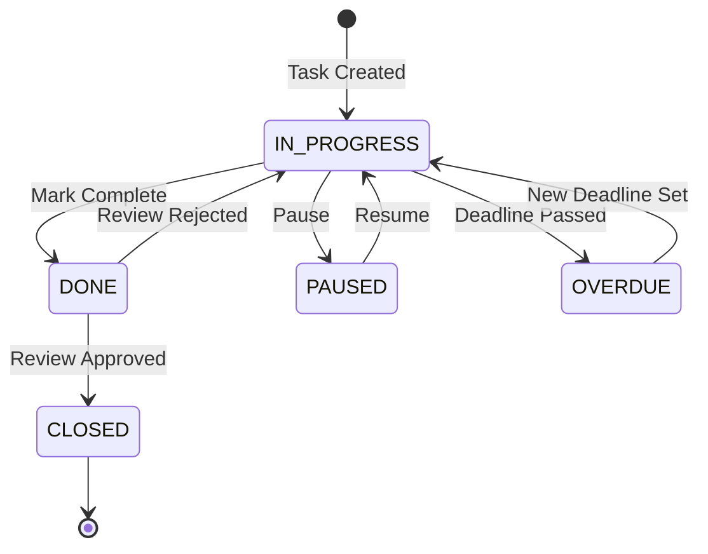

# Feature: Task Management

Status: Implemented  
Owner: Core Team  
Created: 2025-12-12  
Links: —

---

## Purpose

Core task management system enabling creation, assignment, status tracking, and collaboration on tasks. Supports manager-employee workflows with deadlines, subtasks, team assignments, tags, and projects.

---

## Scope

### In scope

- Task creation (via API and Telegram Bot)
- Task status lifecycle (IN_PROGRESS → DONE → CLOSED, PAUSED, OVERDUE)
- Deadline management with date parsing
- Assignee and team assignment
- Subtasks support
- Tags and project categorization
- Completion review workflow (employee requests → manager approves/rejects)

### Out of scope

- Recurring tasks
- Task templates
- Time tracking

---

## Business Rules

- Managers can access all tasks; employees only see tasks they created, are assigned to, or are team members of
- Only managers can set status to CLOSED
- Only managers can reassign tasks, update tags, or update projects
- Employees cannot set deadlines in the past
- When a task deadline passes, status automatically changes to OVERDUE
- When an employee marks task DONE, completion review status becomes PENDING
- When a manager marks task DONE, it auto-approves and closes

---

## User Flows

### Primary flows

1. **Task Creation via Bot**
   - Actor: User (Employee/Manager)
   - Trigger: Send text message to Telegram bot
   - Steps: AI parses message → extracts title, subtasks, deadline → prompts for missing deadline → (for managers) shows assignee selection → creates task
   - Result: Task created with IN_PROGRESS status

2. **Task Status Update**
   - Actor: Assigned user or Manager
   - Trigger: API call or bot callback
   - Steps: Validate permissions → update status → log history → notify stakeholders
   - Result: Status changed, notifications sent

3. **Task Completion Review**
   - Actor: Employee (request) + Manager (approve/reject)
   - Trigger: Employee sets status to DONE
   - Steps: Status → DONE, review status → PENDING → Manager reviews → APPROVED (→ CLOSED) or REJECTED (→ IN_PROGRESS)
   - Result: Task closed or returned for rework

4. **Team Management**
   - Actor: Manager
   - Trigger: PATCH /api/tasks/{id} with assignments
   - Steps: Validate team members → update assignments → set lead → notify added/removed members
   - Result: Team updated, members notified

### Edge cases

- Deadline in past → Employees rejected, Managers allowed
- Status change to CLOSED by employee → Forbidden (403)
- Overdue task gets new future deadline → Status resets to IN_PROGRESS

---

## System Behaviour

- Entry points: `GET/POST /api/tasks`, `PATCH /api/tasks/{id}`, Telegram bot commands
- Reads from: PostgreSQL (Task, User, TaskAssignment, Tag, Project tables)
- Writes to: PostgreSQL (Task, TaskHistory, TaskAssignment, TaskTag, TaskProject)
- Side effects / emitted events: Telegram notifications to stakeholders
- Idempotency: Status updates are idempotent (same status = no-op)
- Error handling: Returns structured JSON errors with status codes 400/401/403/404/500
- Security / permissions: Telegram WebApp validation + role-based access (MANAGER/EMPLOYEE)
- Feature flags / toggles: None
- Observability: Console error logging for failed operations

---

## Diagrams

---

## Verification (Mandatory: describe how to test)

### Test environment

- Environment / stack: Local Docker Compose with PostgreSQL
- Data and reset strategy: Fresh DB migration, seed test users
- External dependencies: Telegram Bot API (can be mocked)

### Test commands

- build: `pnpm build`
- test: `pnpm lint`
- format: `pnpm lint`

### Test flows

**Positive scenarios**

| ID      | Description                 | Level | Expected result                      | Data / Notes                      |
| ------- | --------------------------- | ----- | ------------------------------------ | --------------------------------- |
| POS-001 | Create task via API         | API   | Task created with IN_PROGRESS status | Valid auth, title, assignee       |
| POS-002 | Update task status to DONE  | API   | Status changed, history logged       | Valid task ID, authorized user    |
| POS-003 | Manager approves completion | API   | Status → CLOSED, review → APPROVED   | Manager auth, task in DONE status |

**Negative scenarios**

| ID      | Description                     | Level | Expected result   | Data / Notes          |
| ------- | ------------------------------- | ----- | ----------------- | --------------------- |
| NEG-001 | Employee sets CLOSED status     | API   | 403 Forbidden     | Employee auth         |
| NEG-002 | Unauthorized user modifies task | API   | 403 Access denied | User not in task team |
| NEG-003 | Set deadline in past (employee) | API   | 400 Bad Request   | Past date             |

**Edge cases**

| ID       | Description                     | Level | Expected result              | Data / Notes     |
| -------- | ------------------------------- | ----- | ---------------------------- | ---------------- |
| EDGE-001 | Update deadline on OVERDUE task | API   | Status resets to IN_PROGRESS | Future deadline  |
| EDGE-002 | Same status update twice        | API   | 400 No changes detected      | Idempotent check |

### Test mapping

- Integration tests: —
- API tests: Manual via HTTP client
- Unit tests: —
- Static analysis: ESLint configuration

---

## Definition of Done

- Behaviour matches rules and flows in this document.
- All test flows above are covered by automated tests.
- Static analysis passes with no new unresolved issues.
- Documentation updated.

---

## References

- Code: `app/api/tasks/`, `lib/bot/index.ts`, `prisma/schema.prisma`
- Types: `types/tasks.ts`
- Components: `components/TaskCard.tsx`
