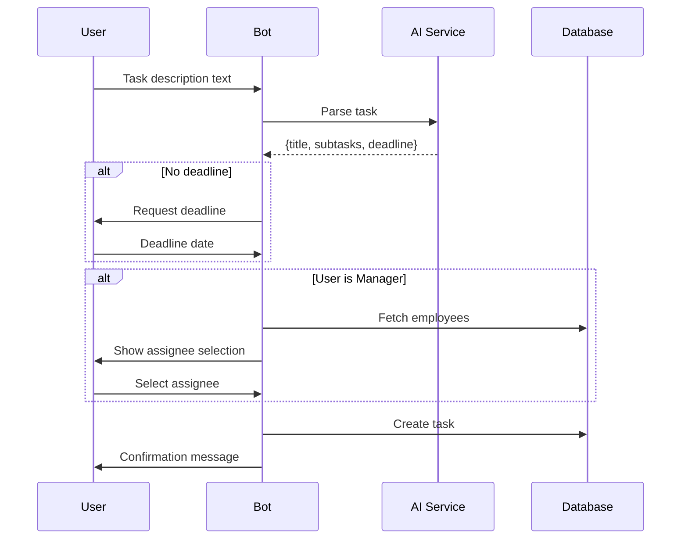

# Feature: Telegram Bot Integration

Status: Implemented  
Owner: Core Team  
Created: 2025-12-12  
Links: —

---

## Purpose

Provides a conversational Telegram bot interface for task management. Users can create tasks by sending natural language messages, manage task status, attach files, update deadlines, and receive notifications—all within Telegram.

---

## Scope

### In scope

- Task creation via natural language processing (AI-powered)
- Task status management via inline keyboards
- Deadline parsing (multiple formats: ISO, DD.MM.YYYY, relative dates like "завтра", "через 3 дня")
- File attachment uploads (documents and images)
- Task listing and navigation
- Assignee selection for managers
- Overdue reason collection
- Task completion review (approve/reject)

### Out of scope

- Voice message transcription
- Inline queries
- Channel/group support (designed for private chats)

---

## Business Rules

- Only whitelisted Telegram users can interact with the bot (env: WHITELIST)
- Manager IDs are configured separately (env: MANAGER_IDS)
- AI parses task descriptions to extract title, subtasks, and deadline
- If no deadline detected, bot prompts user for deadline input
- Managers can select assignees from employee list; employees self-assign
- Deadline formats supported: YYYY-MM-DD, DD.MM.YYYY, DD/MM/YYYY, DD.MM, relative expressions
- Files can only be attached to tasks with status IN_PROGRESS, PAUSED, or OVERDUE
- Task status changes trigger notifications to all stakeholders

---

## User Flows

### Primary flows

1. **Task Creation**  
   - Actor: User  
   - Trigger: Send text message describing task  
   - Steps: Bot shows "Анализирую задачу..." → AI parses → If no deadline, prompt → (Manager) Select assignee → Create task  
   - Result: Task created, confirmation with subtasks list shown

2. **View My Tasks**  
   - Actor: User  
   - Trigger: Tap "Мои задачи" button or /start  
   - Steps: Fetch latest 5 tasks → Display with inline buttons  
   - Result: Task list with quick access to each task

3. **Update Task Status**  
   - Actor: User (with access)  
   - Trigger: Tap status button in task view  
   - Steps: Validate permissions → Update status → Log history → Notify team  
   - Result: Status updated, inline keyboard refreshed

4. **Attach File**  
   - Actor: User  
   - Trigger: Tap "Прикрепить файл" → Select task → Send file  
   - Steps: Show paginated task list → User selects → User sends document/photo → Save attachment  
   - Result: File attached, team notified

5. **Explain Overdue**  
   - Actor: Assignee  
   - Trigger: Tap "Объяснить просрочку" on OVERDUE task  
   - Steps: Prompt for reason → Prompt for new deadline → Update task  
   - Result: Reason logged, new deadline set, status reset to IN_PROGRESS

### Edge cases

- Invalid deadline format → "Не удалось распознать дату" message, re-prompt
- Non-whitelisted user → "Доступ запрещен" message
- File sent without selecting task → Instruction to use /attach command first
- No tasks available for attachment → "У вас пока нет задач" message

---

## System Behaviour

- Entry points: Telegram Bot webhook/polling (grammy library)  
- Reads from: PostgreSQL (Task, User, Attachment tables)  
- Writes to: PostgreSQL (Task, TaskHistory, TaskAssignment, Attachment)  
- Side effects: Telegram API messages to users  
- Idempotency: Callback queries are stateful (pending state maps)  
- Error handling: Try-catch with error logging, user-friendly Russian messages  
- Security / permissions: Whitelist check + role-based access  
- Feature flags: None  
- Observability: Console logging for errors

---

## Diagrams

---

## Verification (Mandatory: describe how to test)

### Test environment

- Environment: Local with BOT_TOKEN configured  
- Data: Test Telegram users in WHITELIST  
- External dependencies: Telegram Bot API, NVIDIA AI API

### Test commands

- build: `pnpm build`
- run bot: `pnpm tsx scripts/bot.ts`
- format: `pnpm lint`

### Test flows

**Positive scenarios**

| ID | Description | Level | Expected result | Data / Notes |
| --- | --- | --- | --- | --- |
| POS-001 | Create task with full info | Integration | Task created, confirmation shown | "Сделать отчёт к пятнице" |
| POS-002 | Attach document | Integration | File saved, team notified | Valid task, PDF file |
| POS-003 | Update status via button | Integration | Status changed, keyboard updated | Inline callback |

**Negative scenarios**

| ID | Description | Level | Expected result | Data / Notes |
| --- | --- | --- | --- | --- |
| NEG-001 | Non-whitelisted user | Integration | Access denied message | Unknown Telegram ID |
| NEG-002 | Invalid deadline format | Integration | Error message, re-prompt | "32 января" |
| NEG-003 | File without task selection | Integration | Instruction message | Direct file send |

**Edge cases**

| ID | Description | Level | Expected result | Data / Notes |
| --- | --- | --- | --- | --- |
| EDGE-001 | Relative deadline "послезавтра" | Integration | Parsed to day after tomorrow | Russian relative date |
| EDGE-002 | Weekday deadline "к пятнице" | Integration | Next Friday date | Russian weekday |

### Test mapping

- Integration tests: Manual Telegram interaction  
- Unit tests: —  
- Static analysis: ESLint

---

## Definition of Done

- Bot responds to all documented commands and flows  
- Deadline parsing handles all specified formats  
- Notifications sent correctly to stakeholders  
- Error messages are user-friendly in Russian

---

## References

- Code: `lib/bot/index.ts`, `scripts/bot.ts`
- AI: `lib/ai.ts`
- Dependencies: grammy, @tma.js/init-data-node